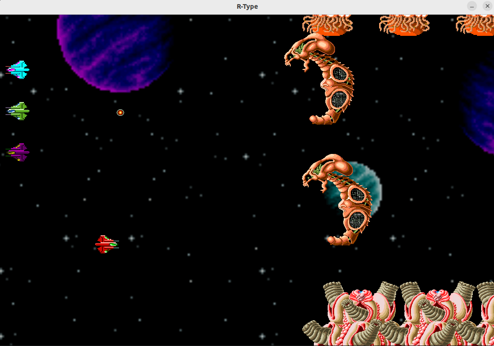
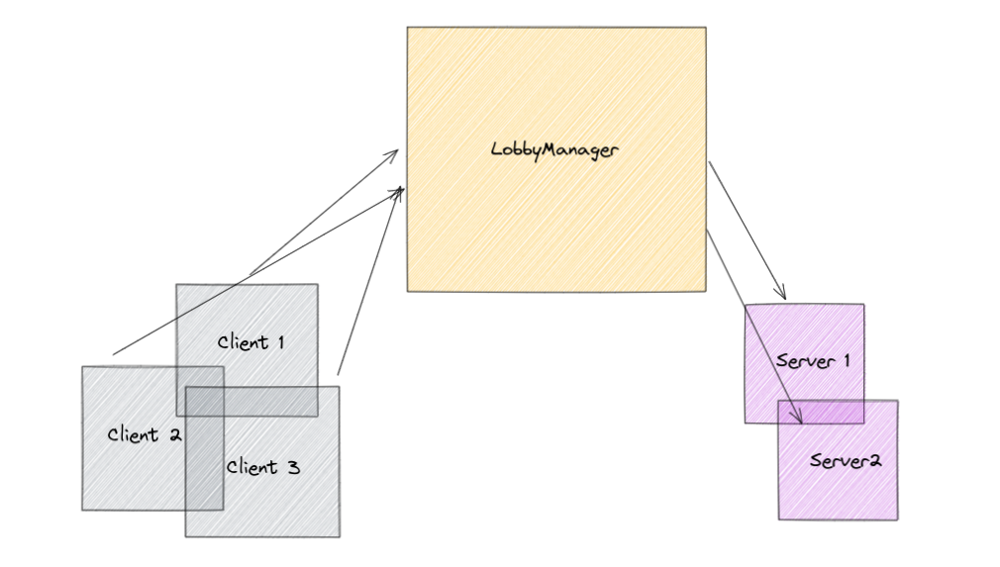
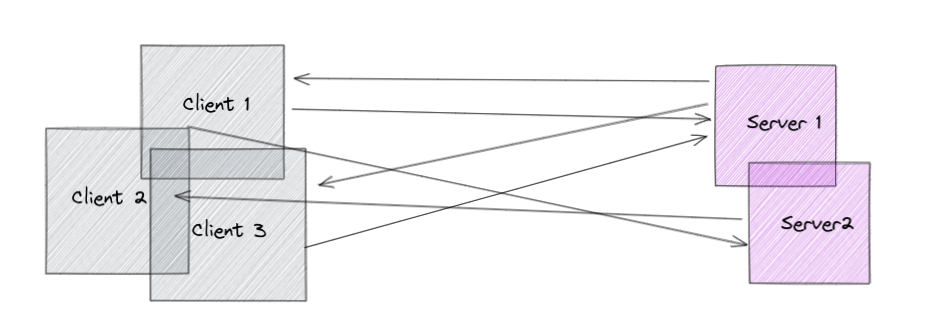

# R-Type

<h1 align="center">
  
  <br>
</h1>

<h3 align="center">Arcade Video Game In Network</h3>

<p align="center">
    <a href="https://en.wikipedia.org/wiki/R-Type"></a>
    <a href="https://discord.com/"></a>
    <a href="https://github.com/EpitechPromo2025/B-CPP-500-LYN-5-1-rtype-maxime.premont"></a>
    <a href="https://twitter.com/rtypefinal2_gz?ref_src=twsrc%5Egoogle%7Ctwcamp%5Eserp%7Ctwgr%5Eauthor"></a>
</p>

## Introduction :checkered_flag:

R-Type is a horizontally scrolling shooter arcade video game developed and released by Irem in 1987 and the first game in the R-Type series. The player controls a star ship, the R-9 "Arrowhead", in its efforts to destroy the Bydo, a powerful alien race bent on wiping out all of mankind. The R-9 can acquire a glowing orbicular device called a "Force", protecting it from enemy fire and providing additional firepower. The arcade version was distributed by Nintendo in North America; it is the last arcade title Nintendo distributed.

## Philosophy :bulb:

The objective of the project is to develop a game that is fun to play and that makes the most of network protocols in order to give the player a competitive spirit.

It is frequent that games are victims of lag, and this is sometimes related to the problem of implementation of the network part. Through an optimized ECS and the speed of the UDP protocol, the R-type aims to revolutionize gaming in the world.

Our philosophy is: Send datagrams faster than lightspeed.

## Install :wrench:

### From release

Download a release [here](https://github.com/EpitechPromo2025/B-CPP-500-LYN-5-1-rtype-maxime.premont/releases)\
If you are on linux dezip the folder, if you are on windows launch the .exe which will install the project.\
You are ready to go to [Usage](#usage)

### From sources

clone the project

```shell
git clone git@github.com:EpitechPromo2025/B-CPP-500-LYN-5-1-rtype-maxime.premont.git
```

launch cmake

```shell
cmake -S . -B ./build/
```

then make

```shell
cd build/
make
```

and the project is finally ready to launch

## Usage :clipboard:

To launch the server:

```shell
./r_type_server  <address> <port> <lobby_status>
```
Now, the clients could connect to the server

To launch the client:

```shell
./r_type_client  <address> <port> <sound> <lobby_status>
```

Enjoy the gameplay, and tell your friends to join you ! :tada:

## Game :video_game:

Here is an example of the game, you control one of the four spaceships, the red one on the picture, you are accompanied by your friends. The objective? To survive as many waves as possible and beat the boss.

For this, shiny points appear randomly, they are bonuses that reinforce the shooting of your ship temporarily, so don't hesitate to take them.

<p align="center">
    <br/>
  
  <br/>
  <br/>
</p>

## Architecture :factory:

Come on, for the brave ones, let's get into the technical side of things.

Our game is divided into two major parts and two major libraries: the client and the server, as well as our network and ECS (Entity Component System) library.

The client and the server use the libraries we have developed, but let's go into the details of the libraries.

Check our schema

### Step 1

The client contact the LobbyManager in TCP to be redirect to server

<p align="center">
    <br/>
  
  <br/>
  <br/>
</p>

### Step 2

The client communicate with the server in UDP, and play the game

<p align="center">
    <br/>
  
  <br/>
  <br/>
</p>


### Entity Component System

Entity Component System (ECS) is a software architectural pattern mostly used in video game development for the representation of game world objects. An ECS comprises entities composed from components of data, with systems which operate on entities' components.

ECS follows the principle of composition over inheritance, meaning that every entity is defined not by a type hierarchy, but by the components that are associated with it. Systems act globally over all entities which have the required components.

## Network UDP & TCP Protocol

The network library is the package that allows the different clients to communicate with the server and to play with their friends.

The principle is simple: you connect in TCP to our Lobby, which like a load balancer manages several game servers that use the UDP protocol.

Then the client is directly redirected to an available game server and switches to UDP communication in order to play.

If you want more information, check the doc about the protocol

- [DOCUMENTATION RFC PROTOCOL R-TYPE 69007](./docs/rfc69007.txt)

## License :book:

© 2022-2023 [MMAN](https://www.youtube.com/watch?v=Py00TertFmw)

Licensed under the [MIT license](https://opensource.org/licenses/MIT) ([`LICENSE-MIT`](LICENSE-MIT)). See the [`COPYRIGHT`](COPYRIGHT) file for more details.

`SPDX-License-Identifier: (MIT)`
